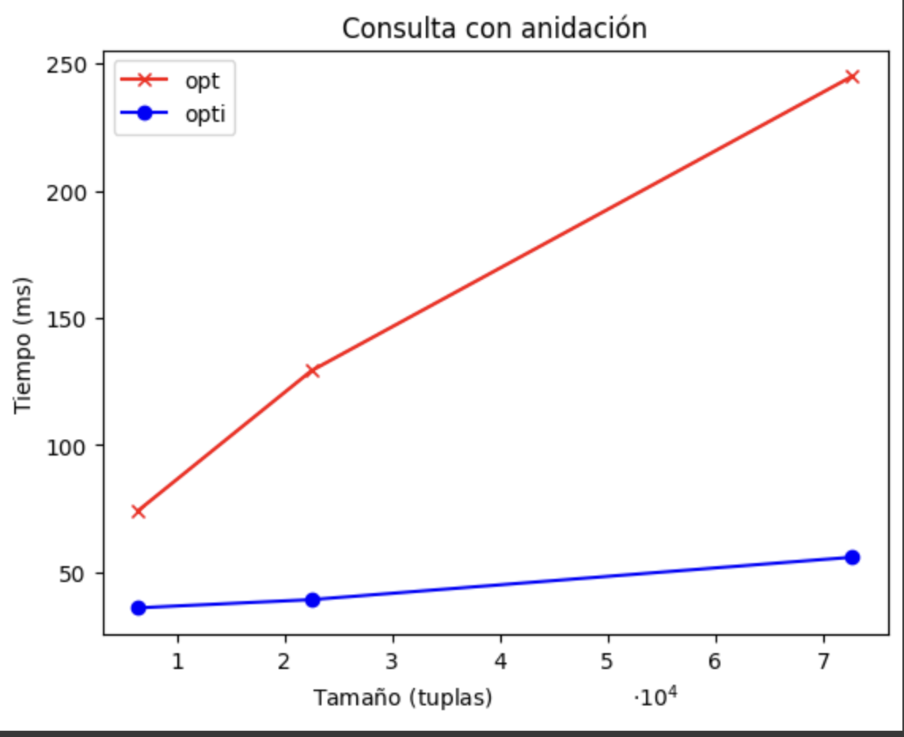
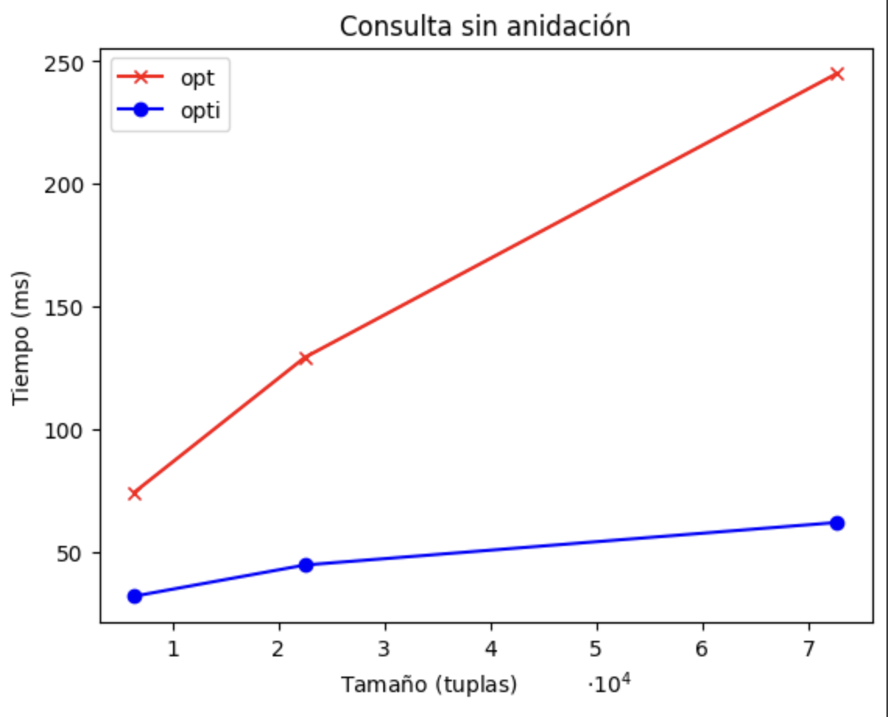

# Laboratorio 7 - Martín Bravo

- Tenemos la relación $R(a,b,c,d)$, con tamaño 1 millón de tuplas y cada página/bloque contiene $B>2$ tuplas ordenados de manera aleatoria, $a$ es la llave que va del 0 al 999.999, para cada consulta esrcibeir el numero de I/O que harán cada uno de los siguientes casos

## a) Encontrar todas las tuplas de R

- Analizar $R$ sin ningún índice: $\#(I/O) = 1.000.000/B$, ya que pasamos por todas las tuplas de manera secuencial.
- Usar un $B+Tree$ unclustered sobre el atributo $a$: Tiene un costo de $\#(I/O)$ mucho mayor a 1.000.000, ya que habría que recorrer todos los nodos del árbol.
- Usar un $B+Tree$ clustered sobre el atributo $a$: Tiene un costo de $\#(I/O) = h + B_m$, con $B_m = 60\%^{-1} * 1.000.000/B$, debido a la estructura del árbol B+Tree y el hecho de que las hojas están ocupadas al 60%.
- Usar un Hash Index unclustered: No es posible.
- Usar un Hash Index clustered: No es posible.

## b) Encontrar todas las tuplas de R tal que $a<50$

- Analizar $R$ sin ningún índice: $\#(I/O) = 500.025/B$, con un peor caso de 1.000.000 y un mejor caso de 50.
- Usar un $B+Tree$ unclustered sobre el atributo $a$: Tiene un costo de $\#(I/O) = h + [50/P] + 50$, considerando la altura del árbol y la búsqueda en las páginas de punteros y datos.
- Usar un $B+Tree$ clustered sobre el atributo $a$: Tiene un costo de $\#(I/O) = h + B_m$, con $B_m = (60\%)^{-1} * 50/B$, debido a la estructura del árbol B+Tree y el hecho de que las hojas están ocupadas al 60%.
- Usar un Hash Index unclustered: No es posible.
- Usar un Hash Index clustered: No es posible.

## c) Encontrar todas las tuplas de R tal que $a=50$

- Analizar $R$ sin ningún índice: $\#(I/O) = 500.000/B$, con el peor caso siendo 1.000.000 y el mejor caso 1.
- Usar un $B+Tree$ unclustered sobre el atributo $a$: Tiene un costo de $\#(I/O) = h + 1$, ya que solo es necesario encontrar el elemento en el árbol.
- Usar un $B+Tree$ clustered sobre el atributo $a$: Tiene un costo de $\#(I/O) = h$, ya que se busca el índice del elemento.
- Usar un Hash Index unclustered: Tiene un costo de $\#(I/O) = 2$, ya que se busca el índice y la dirección del puntero.
- Usar un Hash Index clustered: Tiene un costo de $\#(I/O) = 1$, ya que solo se busca el índice.

# P2
## a)
### Datos sin índice
| Tabla                   | Tipo de Índice | Columnas Indexadas                |
|-------------------------|----------------|----------------------------------|
| opt.pelicula10000       | btree          | (nombre, anho)                   |
| opt.personaje10000      | btree          | (a_nombre, p_nombre, p_anho, personaje) |
| opt.actor10000          | btree          | (nombre)                         |

### Datos con índice
| Tabla                   | Tipo de Índice | Columnas Indexadas                |
|-------------------------|----------------|----------------------------------|
| opti.pelicula10000      | btree          | (nombre, anho), (genero), (nombre) |
| opti.personaje10000          | btree          | (a_nombre), (p_anho), (p_nombre), (p_nombre, p_anho) |
| opti.actor10000          | btree          | (nombre), (genero), (nombre)      |


## b)

- La consultas que se realizó para la base de datos con anidación fue la siguiente:

```sql
-- CON ANIDACIÓN
EXPLAIN ANALYZE
SELECT DISTINCT pelicula.nombre, pelicula.anho
FROM    opti.pelicula100 AS pelicula, 
        opti.personaje100 AS personaje
WHERE pelicula.nombre = personaje.p_nombre
AND   pelicula.anho   = personaje.p_anho
AND   personaje.a_nombre IN (
    SELECT  personaje.a_nombre 
    FROM    opti.pelicula100 AS pelicula, opti.personaje100 AS personaje
    WHERE   personaje.p_nombre = pelicula.nombre
    AND     pelicula.nombre = 'Batman v Superman: Dawn of Justice'
);
```

```
    QUERY PLAN                                                                                     
-----------------------------------------------------------------------------------------------------------------------------------------------------------------------------------
 HashAggregate  (cost=2216.82..2229.34 rows=1252 width=18) (actual time=2053.617..2054.295 rows=664 loops=1)
   Group Key: pelicula.nombre, pelicula.anho
   Batches: 1  Memory Usage: 129kB
   ->  Hash Join  (cost=1042.81..2210.56 rows=1252 width=18) (actual time=78.234..2050.975 rows=1337 loops=1)
         Hash Cond: (((personaje.p_nombre)::text = (pelicula.nombre)::text) AND (personaje.p_anho = pelicula.anho))
         ->  Nested Loop  (cost=830.79..1991.96 rows=1252 width=18) (actual time=64.022..2032.385 rows=1337 loops=1)
               ->  HashAggregate  (cost=830.37..832.98 rows=261 width=16) (actual time=22.777..23.584 rows=340 loops=1)
                     Group Key: (personaje_1.a_nombre)::text
                     Batches: 1  Memory Usage: 61kB
                     ->  Nested Loop  (cost=6.73..829.71 rows=261 width=16) (actual time=19.315..22.261 rows=348 loops=1)
                           ->  Index Only Scan using pelicula10000_nombre on pelicula10000 pelicula_1  (cost=0.28..4.30 rows=1 width=16) (actual time=0.068..0.073 rows=1 loops=1)
                                 Index Cond: (nombre = 'Batman v Superman: Dawn of Justice'::text)
                                 Heap Fetches: 0
                           ->  Bitmap Heap Scan on personaje10000 personaje_1  (cost=6.45..822.80 rows=261 width=32) (actual time=19.235..21.549 rows=348 loops=1)
                                 Recheck Cond: ((p_nombre)::text = 'Batman v Superman: Dawn of Justice'::text)
                                 Heap Blocks: exact=320
                                 ->  Bitmap Index Scan on personaje10000_pnombreanho  (cost=0.00..6.38 rows=261 width=0) (actual time=19.180..19.182 rows=348 loops=1)
                                       Index Cond: ((p_nombre)::text = 'Batman v Superman: Dawn of Justice'::text)
               ->  Index Only Scan using personaje10000_pkey on personaje10000 personaje  (cost=0.42..4.40 rows=4 width=34) (actual time=5.883..5.897 rows=4 loops=340)
                     Index Cond: (a_nombre = (personaje_1.a_nombre)::text)
                     Heap Fetches: 0
         ->  Hash  (cost=116.01..116.01 rows=6401 width=18) (actual time=14.102..14.106 rows=6401 loops=1)
               Buckets: 8192  Batches: 1  Memory Usage: 382kB
               ->  Seq Scan on pelicula10000 pelicula  (cost=0.00..116.01 rows=6401 width=18) (actual time=0.022..6.404 rows=6401 loops=1)
 Planning Time: 3.102 ms
 Execution Time: 2055.002 ms
(26 rows)
```



- La consultas que se realizó para la base de datos sin anidación fue la siguiente:

```sql
-- SIN ANIDACIÓN
EXPLAIN ANALYZE
SELECT DISTINCT personaje2.p_nombre, personaje2.p_anho
FROM opt.personaje100 AS personaje1
JOIN opt.personaje100 AS personaje2
ON personaje1.p_nombre <> personaje2.p_nombre
AND personaje1.a_nombre = personaje2.a_nombre
WHERE personaje1.p_nombre = 'Batman v Superman: Dawn of Justice';
```

```
 QUERY PLAN                                                                                 
----------------------------------------------------------------------------------------------------------------------------------------------------------------------------
 Unique  (cost=33825.74..33925.95 rows=825 width=19) (actual time=210.394..224.437 rows=1287 loops=1)
   ->  Gather Merge  (cost=33825.74..33921.83 rows=825 width=19) (actual time=210.390..220.363 rows=1851 loops=1)
         Workers Planned: 2
         Workers Launched: 2
         ->  Sort  (cost=32825.72..32826.58 rows=344 width=19) (actual time=192.999..194.204 rows=617 loops=3)
               Sort Key: personaje2.p_nombre, personaje2.p_anho
               Sort Method: quicksort  Memory: 62kB
               Worker 0:  Sort Method: quicksort  Memory: 43kB
               Worker 1:  Sort Method: quicksort  Memory: 84kB
               ->  Nested Loop  (cost=0.43..32811.22 rows=344 width=19) (actual time=1.716..191.461 rows=617 loops=3)
                     ->  Parallel Seq Scan on personaje100 personaje1  (cost=0.00..32714.82 rows=20 width=33) (actual time=1.629..183.135 rows=116 loops=3)
                           Filter: ((p_nombre)::text = 'Batman v Superman: Dawn of Justice'::text)
                           Rows Removed by Filter: 723393
                     ->  Index Only Scan using personaje100_pkey on personaje100 personaje2  (cost=0.43..4.69 rows=13 width=35) (actual time=0.048..0.055 rows=5 loops=348)
                           Index Cond: (a_nombre = (personaje1.a_nombre)::text)
                           Filter: ((personaje1.p_nombre)::text <> (p_nombre)::text)
                           Rows Removed by Filter: 1
                           Heap Fetches: 0
 Planning Time: 0.466 ms
 Execution Time: 225.547 ms
(20 rows)
```

